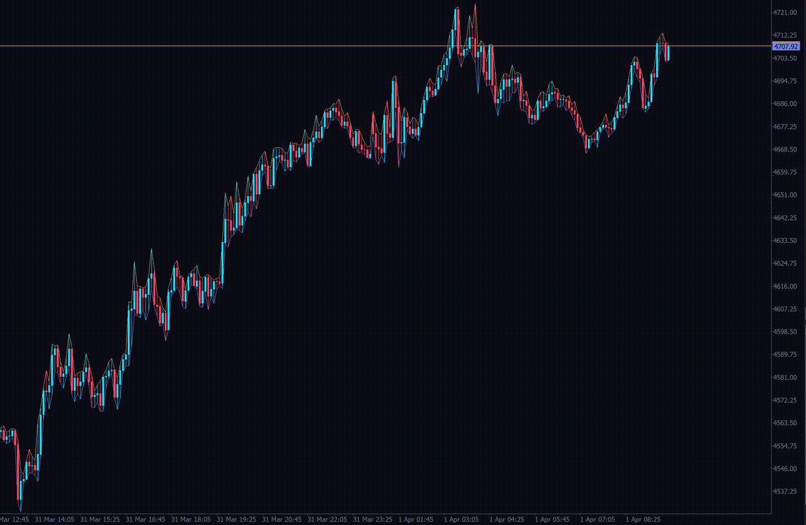

# SMC Order Block EA

<p align="center">
  
</p>

<p align="center">
  <b>A dual-timeframe algorithmic trading bot for MetaTrader 5, built on Smart Money Concepts.</b><br>
  It reads the higher timeframe for the level and the lower timeframe for the trigger:<br>
  Order Blocks are mapped on the HTF, the entry is confirmed by a CISD on the LTF.<br>
  Three fixed pairs, so the two can never be mismatched: <b>H4 → M15 · H1 → M5 · M15 → M1</b>
</p>

<p align="center">
  <a href="https://www.snapchat.com/@cicada.kw"></a>
  <a href="https://www.tiktok.com/@z39"></a>
  <a href="https://www.instagram.com/coding_xaid"></a>
  
  
</p>

---

## Start here

**1. Put it in MetaTrader**

```bash
cd "%APPDATA%\MetaQuotes\Terminal\<terminal-id>\MQL5\Experts"
git clone https://github.com/MrOwl1011/Smc_ZOB_CISD.git SMC_OrderBlock_EA
```

Open `SMC_OrderBlock_EA.mq5` in MetaEditor, press F7. You want `0 errors, 0 warnings`.

**2. Copy the ready made settings**

```text
presets\*.set   ->  MQL5\Presets\
profiles\*.cfg  ->  MQL5\Files\SMC_OrderBlock_EA\
```

**3. Run it**

1. Drag the EA onto a chart.
2. Properties dialog, press **Load**, pick `presets/SMC_1_BestOverall.set`.
3. Watch it mark zones, retests and confirmations.
4. Ready to trade? Flip **Trade execution** on in the panel.

Use the presets. They carry the timeframes and thresholds that work, so you are not
guessing at forty inputs on day one. There is one per market in `presets/`.

**Trading is off until you switch it on.** Until then it only draws.

## What it does

Finds an Order Block on the higher timeframe, waits for price to come back to it, then
needs a CISD confirmation on the lower timeframe before entering. It only takes the trade
if the higher timeframe is trending the same way.

| | |
| --- | --- |
| Entry | Market, when the CISD confirms inside a retested block |
| Stop | The far side of the block |
| Target | 1:1 by default, changeable |
| Size | Fixed lots, 0.01 by default |
| Exposure | One position at a time |

Everything above is switchable from the on-chart panel, no inputs window needed.

**Signal only?** An entry alert announces every confirmed setup with its entry, stop and
target the moment it appears. It works with execution switched off, so you can leave the
bot as a pure signal tool and place the trades yourself. On by default.

## Good to know

| | |
| --- | --- |
| Type | Automated trading robot (MT5 Expert Advisor), written in MQL5 |
| Automation | Fully automatic: finds the setup, opens the trade, sets stop and target, manages the exit |
| Manual use | Leave execution off and it is a pure SMC chart tool |
| Decisions | Rule based and deterministic. No machine learning, no black box, no martingale, no grid, no hedging |
| Runs on | Your own terminal or VPS, any symbol your broker offers |
| Needs | MetaTrader 5, and M1 history for any symbol you trade |

Also known as: algo trading, automated trading, trading bot, trading robot, forex robot,
expert advisor, systematic trading.

<br>

---

<br>

## The details

<details>
<summary><b>The panel</b></summary>

| Section | Controls |
| --- | --- |
| Mode | Easy (zones only) or Advanced |
| Display | Bull and bear zones, labels, fills, old zones, retests, retest start, swings |
| Timeframes | One setting: HTF (the Order Block timeframe) with its CISD timeframe. H4→M15, H1→M5 or M15→M1 |
| CISD | Liquidity sweep, confirmation close, retracement |
| Connection | Retest mode, CISD mode, mitigation stops CISD, trend filter |
| Trading | Trade execution, entry alert, lot size, ride the trend, take profit R, break even, break even points, opposite block exit |
| Configuration | Save, Load, Reset to inputs |

Panel state is remembered per chart. Drag the **◢** handle in the panel's bottom-right corner to resize it; the size is remembered too, and **Reset to input values** restores the default size. Zones, BOS/CHoCH, FVG, retests, swings and fills start hidden.

</details>

<details>
<summary><b>Optional exits</b></summary>

Three extras, each its own switch, all off by default.

| Switch | What it does |
| --- | --- |
| **Ride the trend** | No fixed target. Holds until price reaches the nearest opposite-direction block, which becomes a moving target. Overrides the R:R setting. |
| **Break even** | Once the trade is a set number of points in profit, moves the stop to entry. |
| **Opposite block exit** | A block forming against an open trade, then retested, closes it early. |

</details>

<details>
<summary><b>Settings packages</b></summary>

Seven general packages plus fifteen per-symbol ones, as MT5 presets (`.set`) and panel
profiles (`.cfg`).

| Preset | For |
| --- | --- |
| `SMC_1_BestOverall` | The default |
| `SMC_2_Forex` | FX majors |
| `SMC_3_Metals` | Gold |
| `SMC_4_Indices` | US500, GER30, UK100, US30 |
| `SMC_5_Safest` | Fewer trades, smaller drawdown |
| `SMC_SYM_*` | One symbol and timeframe pair each |

Full tables: [presets/PACKAGES.md](presets/PACKAGES.md) and
[presets/SYMBOL_PRESETS.md](presets/SYMBOL_PRESETS.md).

</details>

<details>
<summary><b>Files and code layout</b></summary>

```text
SMC_OrderBlock_EA.mq5    entry point: inputs, events, wiring
SMC_OB_*.mqh             structure, displacement, blocks, FVG, drawing, panel
SMC_CISD_*.mqh           sweep, series, confirmation, retracement
SMC_Connect_*.mqh        HTF block to LTF CISD, M1 retest, trend filter
SMC_OB_TradeHooks.mqh    the only file that sends orders
SMC_*_SelfTest.mqh       verification suites
DESIGN.md                every rule and threshold, precisely
presets/ profiles/       settings packages
research/                validation study and analysis scripts
```

Three rules the code keeps: closed candles only, nothing repaints, and no trading from
history-scan signals.

</details>

<details>
<summary><b>Testing it yourself</b></summary>

Set `InpRunSelfTest = true` and run the EA in the Strategy Tester. Every module checks
itself and prints a pass or fail summary to the journal.

The validation study of the signals, across 19 markets, is in
[research/REPORT.md](research/REPORT.md) with the data tables beside it.

</details>

<details>
<summary><b>Troubleshooting</b></summary>

| Symptom | Fix |
| --- | --- |
| No zones | History still downloading, or `InpScanDepth` exceeds available bars |
| No retests | M1 history missing; open an M1 chart once to download it |
| No orders | `InpEnableTrading` off, algo trading disabled in the terminal, or a position is already open. The journal says which, tagged `[SMC-TRADE]`. |
| Signal skipped, "stop too close" | The block is narrower than the broker's minimum stop distance |
| Self test fails after an edit | Compare against `DESIGN.md`; the tests assert what is written there |

</details>

<details>
<summary><b>More screenshots</b></summary>

Only the chart above so far. To add more, drop files in `media/` and link them here:
the panel in Advanced mode, and an open trade with its stop and target.

</details>

## Contributing

Pull requests welcome. Two asks: run the self tests and paste the journal summary, and if
you change detection, update `DESIGN.md` in the same commit.

## License

MIT, see [LICENSE](LICENSE). Free to use, change and redistribute, including commercially,
with the copyright notice kept.

Not financial advice. Trading risks real money.

## Keywords

For anyone searching in their own language. English and Arabic in full, Russian in short.

<details>
<summary>English keywords</summary>

**Smart Money Concepts**
`smart money concepts` · `SMC trading` · `smart money trading` · `institutional trading` · `institutional order flow` · `order block` · `order blocks` · `bullish order block` · `bearish order block` · `ZOrder block` · `series order block` · `breaker block` · `mitigation block` · `rejection block` · `supply zone` · `demand zone` · `supply and demand` · `imbalance` · `fair value gap` · `FVG` · `liquidity void` · `liquidity gap` · `liquidity sweep` · `liquidity grab` · `stop hunt` · `stop run` · `inducement` · `displacement` · `expansion candle` · `market structure` · `market structure shift` · `MSS` · `break of structure` · `BOS` · `change of character` · `CHoCH` · `change in state of delivery` · `CISD` · `delivery change` · `internal structure` · `external structure` · `swing high` · `swing low` · `higher high` · `higher low` · `lower high` · `lower low` · `equal highs` · `equal lows` · `dealing range` · `premium and discount` · `equilibrium` · `optimal trade entry` · `OTE` · `point of interest` · `POI` · `mitigation` · `invalidation` · `retest` · `zone retest` · `confirmation entry` · `ICT concepts` · `ICT trading` · `Wyckoff` · `accumulation` · `distribution` · `orderflow`

**Platform**
`MetaTrader 5` · `MetaTrader5` · `MT5` · `MT5 EA` · `MQL5` · `MQL5 source code` · `expert advisor` · `expert advisor MT5` · `EA` · `trading EA` · `MT5 indicator` · `chart indicator` · `custom indicator` · `strategy tester` · `MT5 strategy tester` · `backtest` · `backtesting` · `forward test` · `optimization` · `preset file` · `set file` · `configuration profile` · `magic number` · `MetaEditor` · `OnTick` · `OnChartEvent` · `chart objects` · `on chart panel` · `control panel EA` · `dashboard EA` · `open source EA` · `free expert advisor` · `MQL5 include` · `standard library` · `CTrade`

**Strategy and risk**
`algorithmic trading` · `algo trading` · `automated trading` · `trading bot` · `trading robot` · `systematic trading` · `quantitative trading` · `trend following` · `trend filter` · `multi timeframe` · `multi timeframe analysis` · `higher timeframe bias` · `lower timeframe entry` · `non repainting` · `no repaint` · `closed candle confirmation` · `ATR` · `average true range` · `ATR filter` · `volatility filter` · `risk reward` · `risk to reward` · `risk management` · `stop loss` · `take profit` · `break even stop` · `trailing stop` · `fixed lot` · `position sizing` · `one position at a time` · `drawdown` · `maximum drawdown` · `expectancy` · `win rate` · `profit factor` · `recovery factor` · `Sharpe ratio` · `R multiple` · `Monte Carlo` · `walk forward analysis` · `in sample` · `out of sample` · `overfitting` · `curve fitting` · `statistical validation` · `Wilson interval` · `binomial test` · `Bonferroni correction` · `signal validation` · `trade journal` · `self test` · `unit test`

**Markets**
`forex` · `forex trading` · `FX majors` · `FX minors` · `currency pairs` · `EURUSD` · `GBPUSD` · `USDJPY` · `USDCHF` · `AUDUSD` · `USDCAD` · `NZDUSD` · `CADJPY` · `EURCAD` · `gold` · `gold trading` · `XAUUSD` · `silver` · `XAGUSD` · `metals` · `indices` · `stock indices` · `US30` · `Dow Jones` · `NAS100` · `US100` · `Nasdaq` · `SPX500` · `US500` · `SP500` · `DAX40` · `GER30` · `GER40` · `UK100` · `FTSE100` · `US2000` · `Russell 2000` · `oil` · `crude oil` · `WTI` · `Brent` · `energy` · `CFD` · `spot` · `scalping` · `day trading` · `intraday trading` · `swing trading` · `London session` · `New York session` · `Asian session` · `killzone` · `session timing`

</details>

<details>
<summary>الكلمات المفتاحية بالعربية</summary>

**مفاهيم السمارت موني**
`سمارت موني` · `مفاهيم السمارت موني` · `التداول المؤسسي` · `أوامر المؤسسات` · `أوردر بلوك` · `أوردر بلوك شرائي` · `أوردر بلوك بيعي` · `مناطق الأوامر` · `مناطق الأوامر المؤسسية` · `بلوك الكسر` · `بلوك التعويض` · `منطقة العرض` · `منطقة الطلب` · `العرض والطلب` · `عدم التوازن` · `فجوة القيمة العادلة` · `فجوة سعرية` · `فراغ السيولة` · `سحب السيولة` · `اقتناص السيولة` · `صيد وقف الخسارة` · `استدراج` · `اندفاع سعري` · `شمعة اندفاعية` · `هيكل السوق` · `تغير هيكل السوق` · `كسر الهيكل` · `تغير الشخصية` · `تغير حالة التسليم` · `الهيكل الداخلي` · `الهيكل الخارجي` · `قمة سعرية` · `قاع سعري` · `قمم أعلى` · `قيعان أعلى` · `قمم أدنى` · `قيعان أدنى` · `قمم متساوية` · `قيعان متساوية` · `نطاق التداول` · `منطقة الخصم` · `منطقة العلاوة` · `نقطة التوازن` · `أفضل نقطة دخول` · `نقطة اهتمام` · `إعادة الاختبار` · `تعويض المنطقة` · `إبطال المنطقة` · `دخول بعد التأكيد` · `مفاهيم ICT` · `وايكوف` · `تجميع` · `تصريف` · `تدفق الأوامر`

**المنصة**
`ميتاتريدر 5` · `ميتاتريدر` · `إم تي 5` · `إكسبرت` · `إكسبرت ميتاتريدر 5` · `إكسبرت تداول` · `MQL5` · `كود MQL5` · `مؤشر ميتاتريدر` · `مؤشر مخصص` · `مختبر الاستراتيجيات` · `اختبار تاريخي` · `باك تست` · `اختبار أمامي` · `تحسين الإعدادات` · `ملف إعدادات` · `ملف preset` · `ملف تعريف` · `الرقم السحري` · `ميتا إيديتور` · `لوحة تحكم على الشارت` · `داشبورد` · `إكسبرت مفتوح المصدر` · `إكسبرت مجاني` · `مكتبة قياسية`

**الاستراتيجية وإدارة المخاطر**
`تداول آلي` · `تداول خوارزمي` · `روبوت تداول` · `بوت تداول` · `تداول مبرمج` · `تداول كمي` · `تتبع الاتجاه` · `فلتر الاتجاه` · `تعدد الأطر الزمنية` · `تحليل متعدد الأطر` · `اتجاه الفريم الكبير` · `دخول من فريم صغير` · `بدون إعادة رسم` · `تأكيد إغلاق الشمعة` · `متوسط المدى الحقيقي` · `فلتر التقلب` · `المخاطرة إلى العائد` · `إدارة المخاطر` · `وقف الخسارة` · `أخذ الربح` · `نقل الوقف لنقطة التعادل` · `وقف متحرك` · `حجم عقد ثابت` · `حجم المركز` · `مركز واحد فقط` · `أقصى تراجع` · `التوقع الرياضي` · `نسبة الربح` · `عامل الربح` · `عامل الاسترداد` · `مضاعف المخاطرة` · `مونت كارلو` · `تحليل أمامي متدرج` · `بيانات داخل النطاق` · `بيانات خارج النطاق` · `الإفراط في التحسين` · `تحقق إحصائي` · `اختبار ذاتي` · `سجل التداولات`

**الأسواق**
`فوركس` · `تداول الفوركس` · `العملات الرئيسية` · `العملات الثانوية` · `أزواج العملات` · `يورو دولار` · `باوند دولار` · `دولار ين` · `دولار فرنك` · `أسترالي دولار` · `دولار كندي` · `نيوزلندي دولار` · `الذهب` · `تداول الذهب` · `أوقية الذهب` · `الفضة` · `المعادن` · `المؤشرات` · `مؤشر داو جونز` · `مؤشر ناسداك` · `مؤشر إس آند بي` · `مؤشر داكس` · `مؤشر فوتسي` · `النفط` · `النفط الخام` · `خام برنت` · `خام غرب تكساس` · `الطاقة` · `عقود الفروقات` · `سكالبينج` · `تداول يومي` · `تداول سوينج` · `جلسة لندن` · `جلسة نيويورك` · `الجلسة الآسيوية` · `أوقات الجلسات`

</details>

**Русский**
`MetaTrader 5` · `советник` · `MQL5` · `смарт мани` · `ордер блок` · `зоны институциональных ордеров` · `смена характера поставки` · `слом структуры` · `смена характера рынка` · `имбаланс` · `снятие ликвидности` · `структура рынка` · `мультитаймфрейм` · `фильтр тренда` · `без перерисовки` · `алготрейдинг` · `торговый робот` · `бэктест` · `форекс` · `золото` · `индексы`

GitHub repository topics only accept Latin letters, digits and hyphens, so the Arabic and
Russian terms live here in the README, where search still finds them. Topics for the
repository itself:

```text
mql5  metatrader5  expert-advisor  smart-money-concepts  smc  order-block  cisd
market-structure  break-of-structure  fair-value-gap  algorithmic-trading  trading-bot
forex  gold  xauusd  indices  backtesting  non-repainting
```
