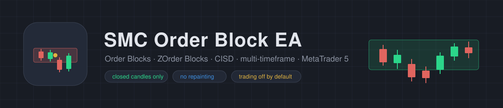
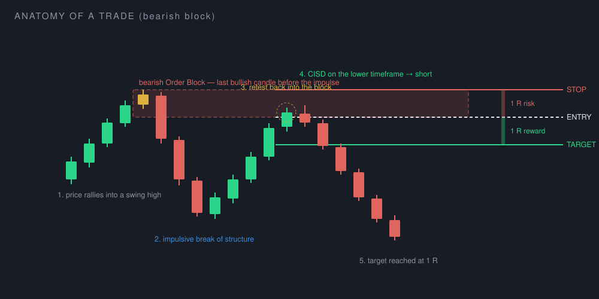
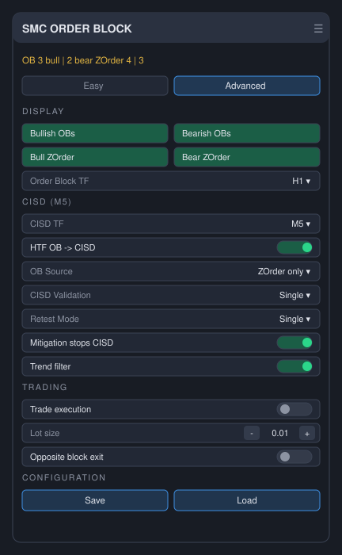
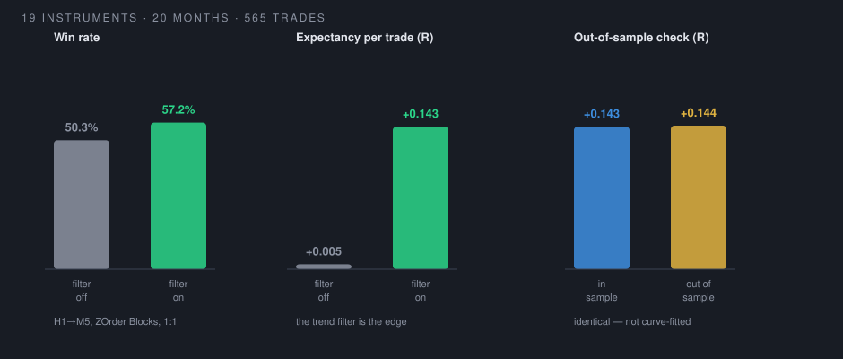
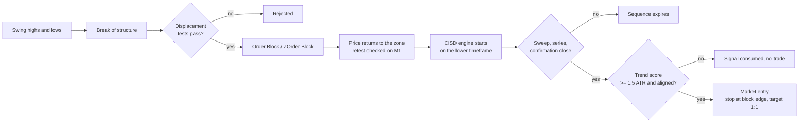

<p align="center">
  
</p>

<p align="center">
  
  
  
  
</p>

# SMC Order Block EA

A MetaTrader 5 Expert Advisor that detects Smart Money Concepts structure on the chart and can trade it. It marks Order Blocks and ZOrder Blocks on a higher timeframe, waits for a CISD confirmation on a lower timeframe, and enters only when the higher timeframe is trending in the same direction.

Trading is switched off by default. Out of the box the EA draws and nothing else.

## Overview

Most SMC tools either draw zones and leave you to trade them by hand, or trade blindly on every touch. This one does both halves and keeps them apart in the code: the detection modules never talk to the broker, and a single file (`SMC_OB_TradeHooks.mqh`) is the only place an order is ever sent.

Three properties shaped the whole design.

| Property | What it means in practice |
| --- | --- |
| Closed candles only | The forming bar is never read. `CopyRates` starts at shift 1, so a signal cannot appear and then disappear. |
| No repainting | A marker never moves once drawn. A zone's right edge stops at the candle that ended it, whether that was mitigation, invalidation or expiry. |
| Timestamped decisions | Modules on different timeframes agree by timestamp, not by bar index, so an M5 confirmation cannot use information an H1 candle had not published yet. |

The strategy was then validated offline on 19 instruments over 20 months. That research lives in [`research/`](research/) and is summarised under [Results](#results).

## Features

| Feature | Description |
| --- | --- |
| Order Blocks | Last opposite-colour candle before an impulsive break of structure, with four zone models including Open-Last Ext |
| ZOrder Blocks | Same idea applied to the full run of opposite candles instead of one |
| Structure | Swing detection with ATR prominence, BOS and CHoCH, each swing breakable once |
| Displacement filter | Four independent impulse tests measured before the move, so a big candle cannot justify itself |
| FVG confluence | Optional requirement that a Fair Value Gap accompanies the block |
| Lifecycle tracking | Live, retested, mitigated (touch / 50% / full), invalidated, expired, superseded |
| CISD engine | Liquidity sweep, candle series, confirmation close, retracement area, with standard deviation projections |
| Multi-timeframe link | HTF block plus LTF CISD, with the retest checked on M1 for precision |
| Trend filter | Accepts a signal only when OB-timeframe displacement is at least 1.5 ATR in the block's direction |
| Trade execution | Market entry, stop on the far side of the block, 1:1 target, fixed lots, one position at a time |
| Opposite block exit | A block created against an open trade, then retested, closes that trade early |
| Control panel | Every day-to-day switch on the chart, with named profiles saved to disk |
| Self tests | 302 checks across five suites, including a live-versus-batch replay equality test |

## Diagrams

The images below are diagrams generated from the project's own logic, not chart screenshots.

| View | Preview |
| --- | --- |
| Signal pipeline |  |
| Anatomy of a trade |  |
| Control panel layout |  |
| Test results |  |

## Requirements

| Requirement | Detail |
| --- | --- |
| Terminal | MetaTrader 5. Developed and tested on build 6182. |
| Compiler | MetaEditor, bundled with the terminal |
| Library | `Trade\Trade.mqh` from the standard MQL5 library, already installed with MT5 |
| History | M1 history for the traded symbol whenever the Order Block timeframe is above M1, because retests are detected on M1 |
| Research tools (optional) | Python 3.12 with `pandas` and `numpy`, only if you want to reproduce the study in `research/` |

## Installation

### 1. Clone into the Experts folder

```bash
cd "%APPDATA%\MetaQuotes\Terminal\<your-terminal-id>\MQL5\Experts"
git clone https://github.com/MrOwl1011/Smc_ZOB_CISD.git SMC_OrderBlock_EA
```

### 2. Compile

Open `SMC_OrderBlock_EA.mq5` in MetaEditor and press F7, or compile from the command line:

```bash
metaeditor64.exe /compile:"MQL5\Experts\SMC_OrderBlock_EA\SMC_OrderBlock_EA.mq5" /log:compile.log
```

A clean build reports `0 errors, 0 warnings`.

### 3. Install the settings packages

Copy them where the terminal looks for them:

```text
presets\*.set   ->  MQL5\Presets\
profiles\*.cfg  ->  MQL5\Files\SMC_OrderBlock_EA\
```

### 4. Attach to a chart

Drag the EA onto a chart, allow algorithmic trading if you intend to trade, then load a preset from the properties dialog.

## Configuration

### Required

Nothing. The defaults draw on the current chart timeframe and place no orders.

### Recommended starting point

Load `presets/SMC_1_BestOverall.set` in the EA properties dialog. It sets H1 blocks, M5 confirmations, ZOrder Blocks only, and the parameters that tested best.

### Inputs worth knowing

| Input | Default | Purpose |
| --- | --- | --- |
| `InpOBTimeframe` | Chart | Timeframe the blocks are detected on |
| `InpCISDTimeframe` | Chart | Timeframe the confirmation is looked for on |
| `InpTrendFilter` | `true` | The trend gate. Turning it off removes the edge entirely. |
| `InpTrendBars` / `InpTrendATRMult` | `20` / `1.5` | Trend score window and the ATR displacement required |
| `InpConnMitigationStops` | `false` | Whether a mitigated block stops looking for a CISD |
| `InpEnableTrading` | `false` | Order execution, off until you switch it on |
| `InpLots` | `0.01` | Fixed position size |
| `InpOppositeBlockExit` | `true` | Close on a retested opposite block |
| `InpMagic` / `InpSlippage` | `20260928` / `20` | Order identity and maximum deviation in points |
| `InpRunSelfTest` | `false` | Run the verification suites on init |
| `InpConfigProfile` | `default` | Name of the panel profile loaded by the panel's Load button |

Inputs marked "panel default" in the source only set the panel's initial state. After that, the panel owns the value and persists it per chart.

### Settings packages

| Preset | Parameters | Intended instruments |
| --- | --- | --- |
| `SMC_1_BestOverall` | swing 4, displacement 2.00 ATR, gate 1.5 | All tested instruments |
| `SMC_2_Forex` | swing 4, displacement 2.00 ATR, gate 1.5 | FX majors |
| `SMC_3_Metals` | swing 4, displacement 1.50 ATR, gate 1.5 | Gold |
| `SMC_4_Indices` | swing 4, displacement 2.00 ATR, gate 1.5 | US500, GER30, UK100, US30 |
| `SMC_5_Safest` | swing 5, displacement 2.00 ATR, gate 2.0 | All, fewer trades |
| `SMC_6_HighestExpectancy` | swing 4, displacement 1.50 ATR, gate 1.5 | Gold |
| `SMC_7_HighestRobustness` | swing 4, displacement 2.00 ATR, gate 1.5 | Same as package 1 |

Details and the reasoning behind each one are in [`presets/PACKAGES.md`](presets/PACKAGES.md).

## Usage

### Reading the chart

Zones are drawn as rectangles and keep their labels through their whole lifecycle. A small mark shows where retest detection starts for each block. CISD confirmations, sweeps and the retracement area are drawn on the confirmation timeframe.

### Using the panel

The panel edits a state record and tells the EA what to rebuild, so switching an option never restarts the EA.

| Section | Controls |
| --- | --- |
| Mode | Easy (zones only) or Advanced |
| Display | Bull and bear zones, ZOrder zones, labels, fills, old zones, retests, retest start, swings |
| Timeframes | Order Block TF and CISD TF, independent of the chart |
| CISD | Liquidity sweep, confirmation close, retracement stages |
| Connection | OB source, retest mode, CISD mode, mitigation stops CISD, trend filter |
| Trading | Trade execution, lot size, opposite block exit |
| Configuration | Save, Load, Reset to input values |

### Trading rules the EA follows

| | |
| --- | --- |
| Entry | Market, at the CISD confirmation |
| Stop | Far side of the Order Block |
| Target | 1:1, the same distance the other way |
| Size | Fixed lots |
| Exposure | One position per symbol and magic number |
| Skipped | Signals whose stop would fall inside the broker's minimum stop distance, and every signal found during the history scan |

## Project Structure

```text
SMC_OrderBlock_EA/
├── SMC_OrderBlock_EA.mq5        entry point: inputs, events, module wiring
├── SMC_OB_Types.mqh             shared enums and structs
├── SMC_OB_MarketData.mqh        closed-candle data access
├── SMC_OB_Structure.mqh         swings, BOS, CHoCH
├── SMC_OB_Displacement.mqh      impulse tests, block candle selection
├── SMC_OB_FVG.mqh               Fair Value Gaps
├── SMC_OB_Engine.mqh            Order Block and ZOrder Block lifecycle
├── SMC_CISD_Engine.mqh          sweep, series, confirmation, retracement
├── SMC_Connect_Engine.mqh       HTF block to LTF CISD, M1 retest, trend filter
├── SMC_OB_TradeHooks.mqh        the only file that sends orders
├── SMC_OB_Panel.mqh             on-chart control panel
├── SMC_Config.mqh               named profiles on disk
├── SMC_*_Visual.mqh             drawing, incremental rather than full redraws
├── SMC_*_SelfTest.mqh           verification suites
├── DESIGN.md                    every rule and threshold, written out precisely
├── docs/                        diagrams used by this README
├── presets/                     seven .set input presets
├── profiles/                    the same seven as panel profiles
└── research/                    validation report, data tables, analysis scripts
```

## How It Works



A block stays usable until price closes through it. Mitigation is recorded but does not end the block unless you ask it to, and a zone keeps extending to the close of the candle that invalidates it.

## Results

From [`research/REPORT.md`](research/REPORT.md). ZOrder Blocks only, 19 instruments, January 2025 to September 2026, outcomes measured in R rather than currency because block heights differ by instrument.

| Configuration | Trades | Win rate | Expectancy | Profit factor | Max drawdown |
| --- | --- | --- | --- | --- | --- |
| H1 to M5, trend gate 1.5, displacement 2.00 | 565 | 57.2% | +0.143 R | 1.34 | 12 R |
| H1 to M5, trend gate 1.5, displacement 1.50 | 813 | 55.5% | +0.109 R | 1.25 | 18 R |
| H1 to M5, trend filter off | 2891 | 50.3% | +0.005 R | 1.01 | 40 R |

In-sample expectancy was +0.143 R and out-of-sample +0.144 R for the recommended configuration. Walk-forward produced five positive windows out of five, and a Monte Carlo bootstrap put the probability of a positive edge at 99.9%.

Three limitations stated plainly. H4 to M15 produced only 127 trades in 20 months and turned negative out of sample, so it is unproven. M15 to M1 is weak and cannot be validated far back, because brokers keep only a few months of M1 history. Fixed lots mean risk per trade is not constant in currency, since the stop is the block height.

## Development

The EA compiles as a single target. Every module is a header included by `SMC_OrderBlock_EA.mq5`, so there is no build system to learn.

1. Edit the `.mqh` module you care about.
2. Compile `SMC_OrderBlock_EA.mq5`.
3. Run the self tests (below) before trusting the result.
4. Read [`DESIGN.md`](DESIGN.md) first if you are touching detection. It fixes the exact definitions the self tests assert.

Keep detection free of broker calls. Entry and exit logic belongs in `SMC_OB_TradeHooks.mqh`.

## Testing

Set `InpRunSelfTest = true` and run the EA in the Strategy Tester. Each suite prints a pass or fail summary to the journal.

| Suite | Checks | Covers |
| --- | --- | --- |
| `[SMC-OB]` | 129 | Structure, displacement, lifecycle, zones, on synthetic and real data |
| `[SMC-OB]` panel | 55 | Panel state, wiring, layout |
| `[SMC-CISD]` | 76 | CISD stages, plus live versus batch equality |
| `[SMC-CONN]` | 36 | Retests, direction, ordering, invalidation, modes, trend filter re-derived from raw candles |
| `[SMC-CFG]` | 6 | Profile save and load round trip |

The connection suite replays every engine in batch mode and requires it to match the live bar-by-bar run exactly. That is the test that would catch look-ahead or repainting.

To reproduce the research instead, export signals with the validator, then:

```bash
python research/smc_research.py
python research/smc_research_grid.py
```

## Troubleshooting

| Symptom | Cause and fix |
| --- | --- |
| No zones appear | History is still downloading, or `InpScanDepth` exceeds available bars. Check the journal for the history scan line. |
| Retests never fire | M1 history is missing for the symbol. Open an M1 chart once to force the download. |
| No orders although signals appear | `InpEnableTrading` is off, algorithmic trading is disabled in the terminal, or a position is already open. The journal logs the reason with a `[SMC-TRADE]` prefix. |
| A signal is skipped as "stop too close" | The block is narrower than the broker's minimum stop distance. Expected on very tight zones. |
| Panel does not react | The chart is in a mode where the panel is hidden, or `InpShowControlPanel` is off. The panel is also skipped in non-visual tester runs. |
| Self test fails after an edit | Compare against `DESIGN.md`. The suites assert the definitions written there, not the code's current behaviour. |

## Contributing

Issues and pull requests are welcome. Two requests:

1. Run the self tests and include the journal summary in the pull request.
2. If a change alters detection, update `DESIGN.md` in the same commit, since the tests follow that document.

## License

No license file is present in the repository, so all rights are reserved by the author. Ask before redistributing.

## Author

Zaid, per the `#property copyright` in `SMC_OrderBlock_EA.mq5`.

---

This EA analyses charts and, when you enable it, places orders. Nothing here is financial advice, and the figures above describe past behaviour on one broker's data over one 20-month period.
